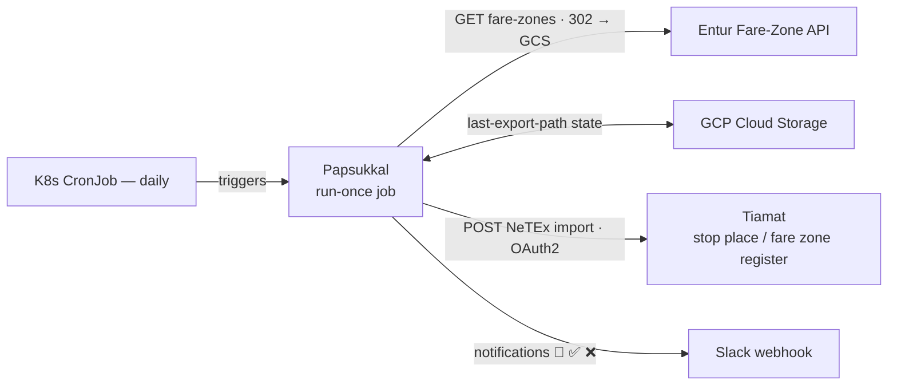
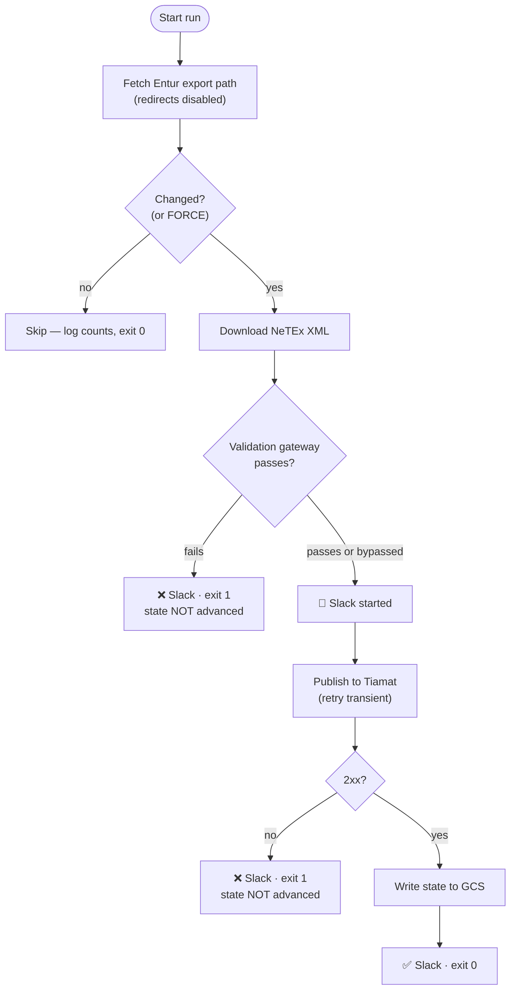
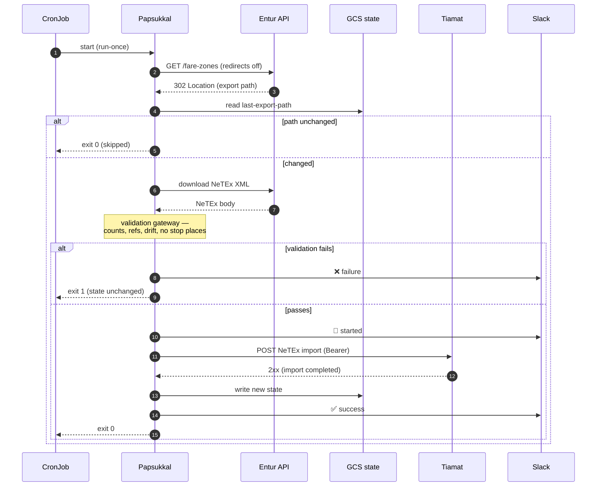

# Papsukkal

> Papsukkal — Akkadian messenger of the gods. Fetches fare-zone NeTEx data from Entur and delivers it to Tiamat.

Papsukkal is a lightweight **run-once batch job** that syncs the Entur fare-zone NeTEx export into
Tiamat (Entur's stop place / fare zone register). It runs as a Kubernetes **CronJob**: on each tick it
checks the Entur API for a new export, validates it, publishes the full dataset to Tiamat when it has
changed, then exits. No always-on process, no web server.

For the full design, rationale and operational details, see **[CLAUDE.md](CLAUDE.md)**.

## Architecture



## How it works



The **validation gateway** is the core safety mechanism: Tiamat imports fare zones with *external
versioning* (a full replace that prunes anything missing from the delivery), so a corrupt or partial
upstream export could delete live data. The gateway sanity-checks the download — count floors,
group-member ref resolution, a fail-closed drift check against the last-good baseline, and a guard
that rejects any delivery containing foreign entities (e.g. a `StopPlace`) — before anything is
published. State is written **only after a `2xx`**, so any failure leaves the baseline untouched and
the next daily tick retries. `FORCE` skips change detection; `BYPASS_VALIDATION` overrides the gateway
(and, under external versioning, authorizes Tiamat to delete the missing zones — use deliberately).

### One run, step by step



## Tech stack

| Concern | Choice |
|---|---|
| Language | Java 25 |
| Framework | Spring Boot 4.x (run-once; `web-application-type=none`) |
| Build | Maven (`org.entur.ror:superpom` parent) |
| HTTP client | Spring `RestClient` |
| State storage | GCP Cloud Storage (`org.entur.ror.helpers:storage-gcp-gcs`) |
| Auth to Tiamat | OAuth2 client-credentials (`org.entur.ror.helpers:oauth2`) |
| Auth to GCP | Workload Identity |
| Notifications | Slack incoming webhook (`org.entur.ror.helpers:slack`) |
| Retry | Spring Framework 7 native `RetryTemplate` (transient-only, backoff) |
| Deployment | GKE `CronJob` (Helm) + Terraform (state bucket) |

## Project layout

```
src/main/java/no/entur/papsukkal/
  SyncRunner                 run-once entrypoint (ApplicationRunner + exit code)
  sync/FareZoneSyncService   orchestrates one sync
  entur/                     Entur fare-zone API client (302 → download)
  validation/                NetexDatasetInspector (StAX) + DatasetValidator (the gateway)
  publish/                   TiamatNetexPublisher (+ transient/fatal classification)
  state/                     GcsSyncStateStore (sync-state/last-sync.json)
  slack/                     SlackNotifier
  config/                    @ConfigurationProperties + bean wiring
helm/papsukkal/              Helm chart (CronJob, ConfigMap, External Secrets)
terraform/                   GCS state bucket
```

## Build & test

Requires **JDK 25** (run Maven on it):

```bash
JAVA_HOME=$(/usr/libexec/java_home -v 25) mvn -B verify
```

Tests are self-contained (no external services): unit tests, a full-wiring end-to-end test, and a
Spring context-load smoke test. `mvn -B -ntp test` runs them all.

## Configuration

Structural defaults live in `src/main/resources/application.yml`; per-environment values come from the
mounted ConfigMap and secrets at deploy time (see the Helm chart). Key runtime settings:

| Env var | Purpose |
|---|---|
| `PAPSUKKAL_ENTUR_CLIENT_NAME` | `ET-Client-Name` header for the Entur API |
| `GCS_PROJECT_ID` / `GCS_STATE_BUCKET` | state bucket (auth via Workload Identity) |
| `TIAMAT_NETEX_IMPORT_URL` | Tiamat sync import endpoint |
| `TIAMAT_IMPORT_TYPE` | blank → Tiamat default, or `MERGE` |
| `TIAMAT_OAUTH_TOKEN_URI` / `TIAMAT_OAUTH_AUDIENCE` | OAuth2 client-credentials |
| `SPRING_SECURITY_OAUTH2_CLIENT_REGISTRATION_TIAMAT_CLIENT_ID` / `_SECRET` | OAuth client creds (from a secret) |
| `SLACK_URL` | Slack incoming-webhook URL (blank disables notifications) |
| `FORCE` | `true` → skip change detection, publish unconditionally |
| `BYPASS_VALIDATION` | `true` → skip the validation gateway (authorizes deletions) |
| `TRIGGER` | `manual` tags ad-hoc runs in notifications |

## Docker

The image packages the CI-built fat jar (it does not build in-image — the `superpom` parent needs
Entur's Maven repo):

```bash
mvn -B -DskipTests package          # produces target/papsukkal.jar
docker build -t papsukkal:dev .
```

## Deployment

- **Helm** — `helm/papsukkal/` (standalone chart: CronJob + ConfigMap + External Secrets). See
  [helm/papsukkal/README.md](helm/papsukkal/README.md).
- **Terraform** — `terraform/` (the GCS state bucket; bucket access is granted by the infrastructure
  provisioner). See [terraform/README.md](terraform/README.md).

### Manual / force run

```bash
# normal manual run (still honours change detection)
kubectl create job --from=cronjob/papsukkal papsukkal-manual-$(date +%s)

# force a full resync AND override the validation gateway
kubectl create job --from=cronjob/papsukkal papsukkal-force-$(date +%s) --dry-run=client -o yaml \
  | kubectl set env --local -f - FORCE=true BYPASS_VALIDATION=true -o yaml | kubectl create -f -
```

## Observability

Logs are structured JSON (`logging.structured.format.console=gcp`). The fare-zone and group counts are
emitted as structured fields on each run — queryable in Cloud Logging as `jsonPayload.fareZoneCount`,
`jsonPayload.groupCount`, `jsonPayload.memberCount` (with `outcome`, `trigger`, `exportPath`,
`durationMs`). A Cloud Logging log-based metric can be defined on these if a Prometheus timeseries is
wanted later (see [CLAUDE.md › Observability](CLAUDE.md)).

## Documentation

- **[CLAUDE.md](CLAUDE.md)** — full design, the validation gateway, Tiamat import & auth, scheduling,
  error handling, and the open prerequisites for go-live.
- **[ARCHITECTURE_REVIEW.md](ARCHITECTURE_REVIEW.md)** — architecture review notes.

## Naming

Follows the platform's Babylonian/Mesopotamian deity convention (Tiamat, Marduk, Kakka, Nusku, Kingu).
Papsukkal is the messenger god — fitting for a service whose sole job is to carry data between systems.
